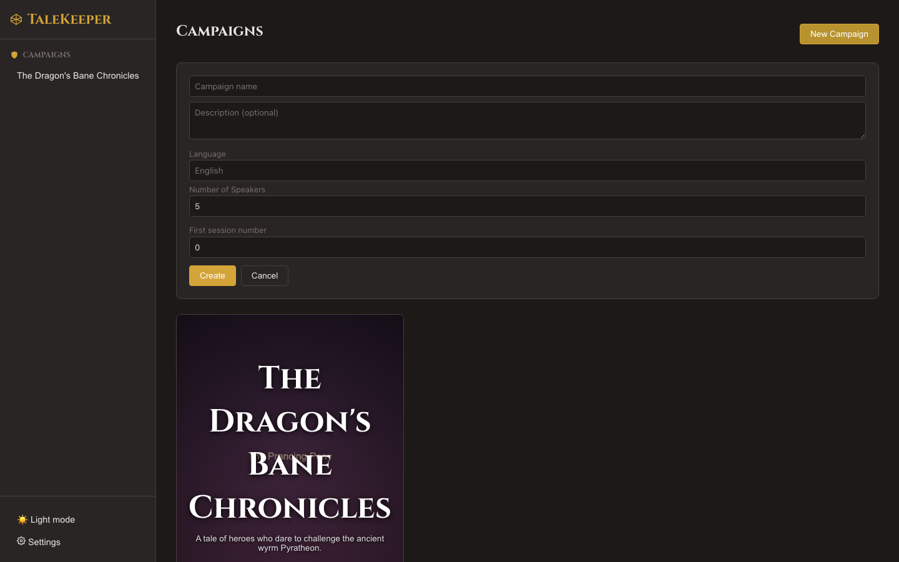
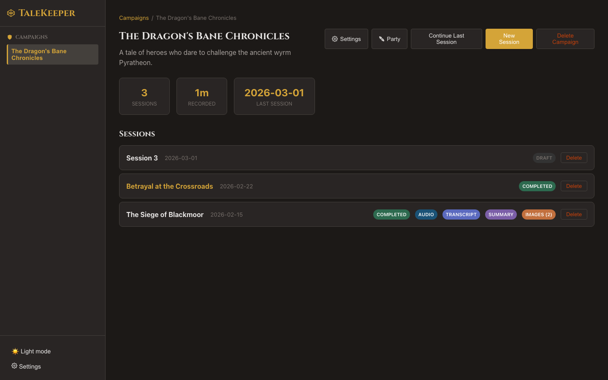

# Managing Campaigns

## Founding Your Company

A **campaign** is your top-level container — think of it as one continuous adventure or storyline. Each campaign holds sessions, a character roster, and shared settings.

### Creating a Campaign

| Field | Description | Default |
|-------|-------------|---------|
| Name | Your campaign's title | — |
| Description | A brief synopsis | — |
| Language | Primary spoken language | English |
| Number of Speakers | Expected party size (1–10) | 5 |

!!! tip "Speaker Count Matters"
    The speaker count helps TaleKeeper figure out who's who in the recording. Set it close to your actual party size for the best results — it doesn't need to be exact.

### The Campaign Dashboard

Your dashboard shows:

- All sessions in chronological order
- Session count, total recorded time, and most recent session date
- Quick access to create a new session
- A **Continue Last Session** button for instant access to your most recent session

Each session row displays **content badges** showing what data is available at a glance:

| Badge | Color | Meaning |
|-------|-------|---------|
| **Status** (Draft, Recording, Completed, etc.) | Varies | Current session state |
| **Audio** | Blue | Audio recording is attached |
| **Transcript** | Purple | Transcript has been generated |
| **Summary** | Violet | One or more summaries exist |
| **Images** ×N | Orange | Scene illustrations generated (with count) |

### Editing Session Names

Click any **session title** to rename it inline. Press ++enter++ to save or ++escape++ to cancel. For completed sessions, a **Regenerate Name** button lets the AI suggest a narrative title based on the transcript (e.g., "The Siege of Blackmoor").

### Editing Campaign Settings

Click on the campaign name or settings to modify:

- **Name and description** — update anytime
- **Language** — changes the default for new sessions
- **Speaker count** — adjusts diarization defaults
- **Voice Signature Confidence** — controls how strictly TaleKeeper matches voices to known speakers. Lower is more lenient (more likely to make a match), higher is stricter (fewer wrong matches). The default works well for most groups
- **Session start number** — for campaigns that didn't start at session 1

!!! tip "Hidden Feature: Session Renumbering"
    Changing the **session start number** automatically renumbers all existing sessions and updates any sessions that still have the default "Session N" name. Useful if you're importing a campaign that started as session 15 in a larger arc.

### Deleting a Campaign

Deleting a campaign permanently removes all its sessions, recordings, transcripts, summaries, and images. This cannot be undone.

Next: [Set Up Your Character Roster →](roster.md)
