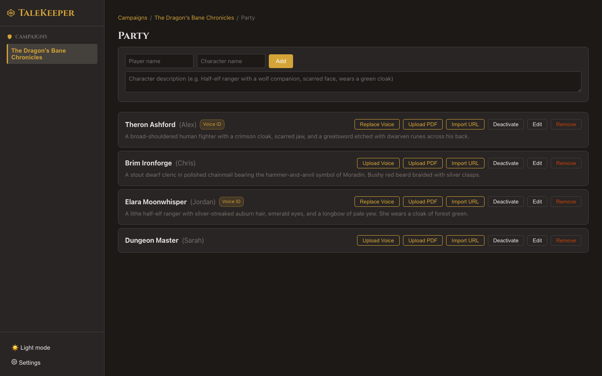

# Character Roster

## Assembling the Party

The **roster** tracks your campaign's characters — their names, players, and visual descriptions. This information enriches summaries, illustrations, and speaker identification.

### Adding Characters Manually

Click **Add Character** and fill in:

| Field | Description |
|-------|-------------|
| Player Name | The real-world player |
| Character Name | Their in-game character |
| Description | Visual appearance and notable features |

!!! info "Why Descriptions Matter"
    Character descriptions are used in two powerful ways:

    1. **Summaries** — the AI references them for accurate character portrayal
    2. **Illustrations** — scene images include character appearances for visual consistency

### Importing from D&D Beyond

!!! tip "Hidden Feature"
    Paste a **D&D Beyond character URL** and TaleKeeper automatically pulls the character's class, race, appearance, and equipment details.

1. Open your character on D&D Beyond
2. Copy the character page URL
3. Paste it into the **Sheet URL** field on the roster entry
4. TaleKeeper fetches and extracts a visual description via AI

### Uploading a PDF Character Sheet

!!! tip "Hidden Feature"
    Upload a **PDF character sheet** and the AI will extract a visual description from it — works with official sheets, homebrew, and any format.

### Importing from Any URL

!!! tip "Hidden Feature"
    Have a character on a different platform? Paste **any web URL** containing character information and TaleKeeper will attempt to extract relevant details.

### Refreshing Descriptions

!!! tip "Hidden Feature"
    Click **Refresh** on a roster entry to re-fetch and re-extract the description from the stored URL. Useful after character changes or level-ups.

### Uploading a Voice Sample

!!! tip "Hidden Feature"
    Teach TaleKeeper your players' voices **before you even start recording**. Upload a short audio clip of each player talking, and TaleKeeper will automatically recognize them in future sessions.

1. Find the player's entry on the roster
2. Click **Upload Voice**
3. Select an audio file — a voice memo, a clip from an old recording, or anything with that player speaking for 30 seconds to 2 minutes
4. TaleKeeper processes the clip and creates a voice profile

Once uploaded, a green **Voice ID** badge appears next to the character's name. In future sessions, TaleKeeper uses these profiles to automatically identify who's speaking.

To replace a voice sample with a better one, click **Replace Voice** (the button changes label once a signature exists).

See [Voice Signatures](../speakers/voice-signatures.md) for more details on how automatic speaker recognition works.

### Active vs Inactive Characters

Toggle characters as **active** or **inactive**. Inactive characters are hidden from speaker suggestions but preserved in the roster for reference.

Next: [Record Your First Session →](../recording/index.md)
