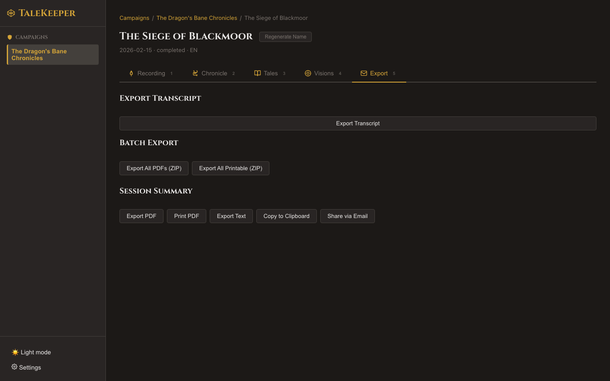

# PDF Export

## Bound in Parchment

The **Export** tab (++5++) lets you create beautiful, D&D-themed PDF documents from your summaries.

### Session Chronicle PDF

Export your full session summary as a themed PDF featuring:

- **Parchment background** with warm radial gradient
- **Medieval typography** — Cinzel headings and Crimson Text body
- **Decorative borders** with ornamental fleurons (✦)
- **Drop cap** styling on the first paragraph
- **Ornamental dividers** (◆) between sections
- Campaign name, session name, and date in the header

### Character Journal PDFs

Each POV journal entry can be exported as its own PDF, titled *"The Journal of [Character Name]"* with a footer reading *"As recorded by [Player Name]"*.

!!! tip "Hidden Feature: Hero Image"
    If you've generated any [scene illustrations](../illustrations/index.md), the most recent image is automatically included at the top of your PDF as a hero image.

!!! tip "Hidden Feature: Printable Mode"
    Click **Print PDF** instead of **Export PDF** to get a **white background** version — no parchment texture, cleaner for actual printing. Same beautiful typography, just printer-friendly.

### Batch Export

!!! tip "Hidden Feature: ZIP Download"
    Click **Export All PDFs (ZIP)** to download every summary for a session in one archive:

    - Full summary saved as `session-chronicle.pdf`
    - Each POV journal saved as `{character-name}-pov.pdf`
    - All sharing the same hero image

    Also available: **Export All Printable (ZIP)** for print-friendly versions.

Next: [Text & Transcript Export →](text-export.md)
