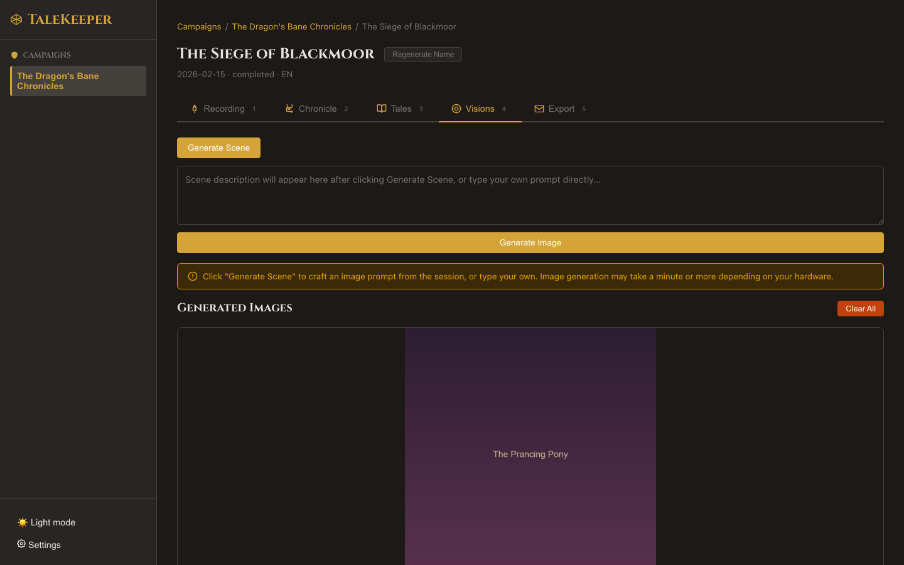

# Scene Illustrations

## Visions of Adventure

The **Visions** tab (++4++) lets you generate AI artwork depicting dramatic moments from your session.

### How It Works

Image generation is a two-step process:

1. **Scene Crafting** — an LLM reads your transcript and crafts a vivid scene description focusing on one dramatic moment
2. **Image Generation** — the description is sent to an image model to create the artwork

### Generating an Image

1. Switch to the **Visions** tab
2. Click **Generate Image**
3. Watch the progress phases:
    - *"Crafting scene..."* — AI is writing the scene description
    - *"Generating image..."* — image model is rendering
    - *Done!* — image appears in the gallery

!!! tip "Hidden Feature: Edit the Scene Description"
    Before generation begins, you can **edit the scene description** that the AI crafted. This lets you steer the image toward a specific moment or adjust details.

!!! tip "Hidden Feature: Character Appearance Consistency"
    If your [character roster](../campaigns/roster.md) has visual descriptions, they're included in the scene prompt. This means your characters look consistent across different illustrations — Theron always has his red cloak, Elara always carries her silver staff.

### Creating Variations

!!! tip "Hidden Feature"
    Click **Generate Image** again to create a different scene or variation. Each generation is independent — you can build a gallery of multiple moments from the same session.

### Managing Images

- Images are displayed newest-first in the gallery
- Delete individual images or clear all images for a session
- The most recent image is used as the **hero image** in PDF exports

### Requirements

- An **image generation provider** must be configured (see [Settings](../settings/index.md))
- An **LLM provider** is needed for scene description crafting
- Works with Ollama (macOS only for images), OpenAI DALL-E, ComfyUI, Stable Diffusion, or any OpenAI-compatible image API

Next: [Export Your Work →](../export/index.md)
