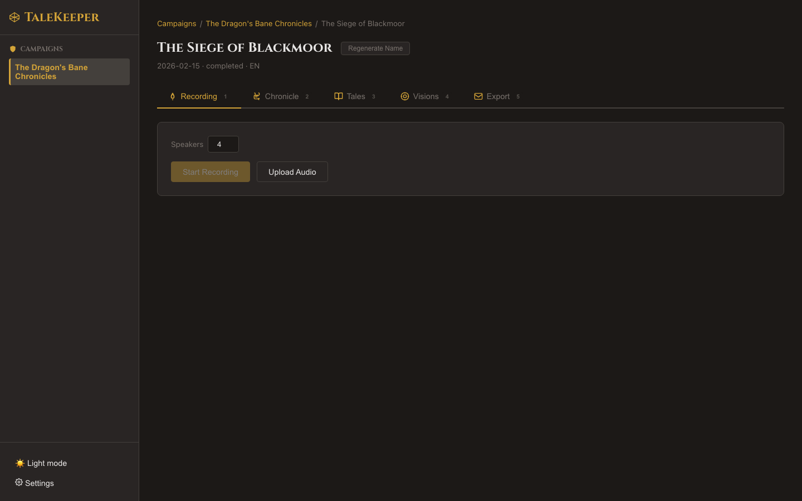

# Live Recording

## Roll for Initiative

The **Recording** tab (keyboard shortcut: ++1++) is where your session begins. TaleKeeper captures audio directly from your microphone and processes it when you stop.

### Starting a Recording

1. Navigate to your session's **Recording** tab
2. Set the **Speakers** count (1–10) to match your party size
3. Click **Start Recording** (the red button)

!!! note "Microphone Permissions"
    Your browser will ask for microphone access the first time. TaleKeeper needs this to capture audio — it never leaves your machine.

### During Recording

While recording, you'll see:

- A **pulsing red dot** with elapsed time (HH:MM:SS)
- **Pause** and **Stop** buttons
- A recording badge in the session header visible from any tab

You can:

- **Pause** — temporarily halt recording, then **Resume**
- **Stop** — end the recording and begin processing

!!! tip "Hidden Feature: Live Transcription"
    Enable **live transcription** in Settings to see preview transcript segments appear in real time as you record. These are preliminary — the final transcript will be more accurate with proper speaker labels.

### After Stopping

When you stop recording, TaleKeeper automatically:

1. Merges audio chunks into a single file
2. Converts to the format needed for transcription
3. Runs speech-to-text (Whisper)
4. Runs speaker diarization (identifies who spoke when)
5. Generates an AI session name (if an LLM is configured)

A progress bar shows the current phase:

- **"Uploading..."** — finalizing audio
- **"Transcribing X / Y chunks — ~N min remaining"** — speech recognition in progress
- **"Assigning speakers..."** — diarization running

!!! tip "Hidden Feature: Speaker Count Override"
    You can adjust the speaker count right before stopping — useful if unexpected guests joined or someone left early.

!!! warning "One at a Time"
    Only one session can be recorded at a time. If another session is recording, you'll see a message indicating it's locked.

Next: [Or Upload Pre-Recorded Audio →](uploading.md)
