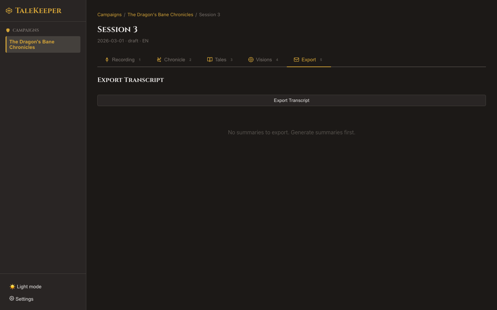

# Uploading Audio

## Recovered Scrolls

Already have a recording from another device? Upload it directly instead of recording live.

### How to Upload

1. Go to the **Recording** tab (++1++)
2. Click **Upload Audio**
3. Select your audio file

TaleKeeper accepts common audio formats and automatically converts them for processing.

### What Happens Next

After upload, the same processing pipeline runs automatically:

1. Audio conversion (mono, 16kHz WAV)
2. Transcription
3. Speaker diarization
4. Auto session naming

!!! warning "Replacing Audio"
    Uploading new audio to a session that already has a recording will **replace** the previous audio and clear the existing transcript and speaker assignments. Summaries and images are preserved.

Next: [Understanding Your Transcript →](../transcription/index.md)
