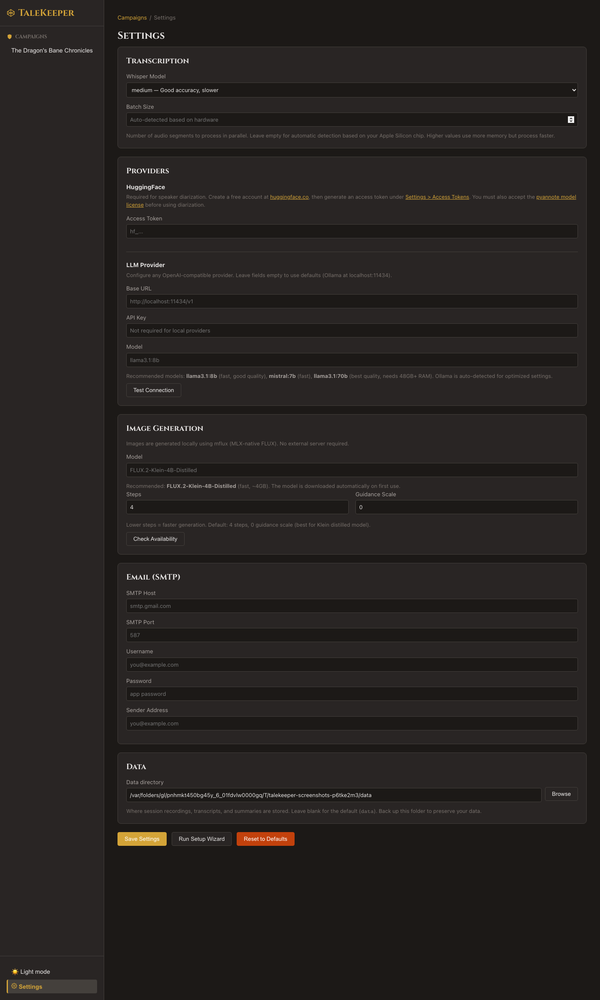

# Settings

## The Artificer's Workshop

The Settings page lets you configure TaleKeeper's behavior, AI providers, and integrations.

### Transcription

| Setting | Description | Default |
|---------|-------------|---------|
| Whisper Model | Speech recognition model | `distil-large-v3` |
| Batch Size | Parallel processing chunks (empty = auto-detected) | Auto |

**Model guide:**

| Model | Speed | Accuracy | Use Case |
|-------|-------|----------|----------|
| `tiny` | ~30 sec / 10 min audio | Lower | Quick tests |
| `base` | ~1 min / 10 min audio | Fair | Short sessions |
| `small` | ~2 min / 10 min audio | Good | Casual use |
| `medium` | ~3 min / 10 min audio | Very Good | Balanced option |
| **`distil-large-v3`** | ~2 min / 10 min audio | **Excellent** | **Recommended** |
| `large-v3` | ~5 min / 10 min audio | Best | Critical recordings, accented speech |

!!! info "Optimized for Apple Silicon"
    TaleKeeper's transcription is built specifically for Apple Silicon Macs, giving you fast, accurate results. It automatically filters out silences and background noise before processing your recording, so you get cleaner transcripts without any extra steps.

!!! info "Batch Size"
    This controls how much of your recording TaleKeeper processes at once. Leave it empty and TaleKeeper will choose the best value for your Mac automatically. Only change this if you notice slowdowns or unresponsiveness during transcription.

### Providers

#### HuggingFace

| Field | Description |
|-------|-------------|
| Token | HuggingFace access token for speaker diarization |

Automatic speaker identification (figuring out who said what) requires a HuggingFace token. To obtain one:

1. Create a free account at [huggingface.co](https://huggingface.co)
2. Accept the license at [pyannote/speaker-diarization-3.1](https://huggingface.co/pyannote/speaker-diarization-3.1)
3. Generate an access token in your [HuggingFace settings](https://huggingface.co/settings/tokens)
4. Paste it into the HuggingFace Token field

!!! warning "Required for Speaker Detection"
    Without a HuggingFace token, transcription still works but all speech will appear under a single speaker — TaleKeeper won't be able to tell voices apart.

#### LLM Provider

Configure the AI that powers summaries, session naming, and scene descriptions.

| Field | Description | Default |
|-------|-------------|---------|
| Base URL | Your AI service's address | `http://localhost:11434/v1` |
| API Key | Access key (not needed for Ollama) | — |
| Model | Which model to use | `llama3.1:8b` |

Click **Test Connection** to verify. A green checkmark means you're connected.

!!! info "Provider Compatibility"
    TaleKeeper works with Ollama, OpenAI, LM Studio, and most other AI services.

### Image Generation

TaleKeeper generates scene illustrations directly on your Mac — no internet connection or external service required.

| Field | Description | Default |
|-------|-------------|---------|
| Model | Which image model to use | `FLUX.2-Klein-4B-Distilled` |
| Steps | How many passes the model makes (more = more detail, slower) | `4` |
| Guidance Scale | How closely the image follows the description (higher = stricter) | `0` |

Click **Check Availability** to verify that mflux is installed.

!!! info "Apple Silicon Required"
    Image generation runs natively on Apple Silicon (M1 and newer). No internet connection, external service, or special hardware is needed — everything happens directly on your Mac.

!!! tip "Tuning Image Quality"
    The defaults (4 steps, 0 guidance) are optimized for the Klein distilled model. Increasing steps produces more detailed images but takes longer. Increasing guidance scale makes the image follow the prompt more closely.

### Email (SMTP)

Configure email for [sharing summaries](../export/email-sharing.md).

| Field | Description | Example |
|-------|-------------|---------|
| SMTP Host | Mail server | `smtp.gmail.com` |
| SMTP Port | Server port | `587` |
| Username | Login | `you@gmail.com` |
| Password | App password | ••••••••  |
| Sender Address | From address | `you@gmail.com` |

!!! info "Password Security"
    Passwords are encrypted at rest in TaleKeeper's database. They're never stored in plaintext.

### Data Directory

Where TaleKeeper stores all recordings, transcripts, images, and the database.

- Click **Browse** to open your system's native folder picker
- Or type a path directly
- Default: `data/` in the TaleKeeper directory

!!! tip "Backup This Folder"
    Your entire TaleKeeper archive lives in this directory. Back it up to preserve your campaign history.

### Theme

TaleKeeper supports **dark** and **light** themes. Toggle between them using the theme button in the **sidebar footer** (☀️ / 🌙).

- **Dark mode** is the default
- On first launch, TaleKeeper matches your Mac's current dark or light mode setting
- Your preference is remembered across sessions

### Re-run Setup Wizard

Click **Run Setup Wizard** at the bottom to walk through initial configuration again.

### Reset to Defaults

Click **Reset to Defaults** to restore all settings to their original values. Your **API keys and tokens are preserved** — only model, URL, and tuning preferences are reset.

### Advanced: Environment Variables

If you're running TaleKeeper in a shared or server environment, these settings can be configured before launch. Most users won't need these — everything is configurable through the Settings page.

| Variable | Description | Default |
|----------|-------------|---------|
| `TALEKEEPER_CORS_ORIGINS` | Allowed CORS origins (comma-separated) | `http://localhost:5173` |
| `TALEKEEPER_SECRET` | Encryption key for stored passwords | Built-in default |
| `LLM_BASE_URL` | LLM provider URL | `http://localhost:11434/v1` |
| `LLM_API_KEY` | LLM API key | — |
| `LLM_MODEL` | LLM model name | `llama3.1:8b` |
| `HF_TOKEN` | HuggingFace token for diarization | — |
| `IMAGE_MODEL` | Image model name | `FLUX.2-Klein-4B-Distilled` |
| `IMAGE_STEPS` | Image inference steps | `4` |
| `IMAGE_GUIDANCE_SCALE` | Image guidance scale | `0` |

!!! note "Priority"
    Settings saved in the UI take precedence over environment variables.

Next: [Tips & Tricks →](../tips-and-tricks.md)
