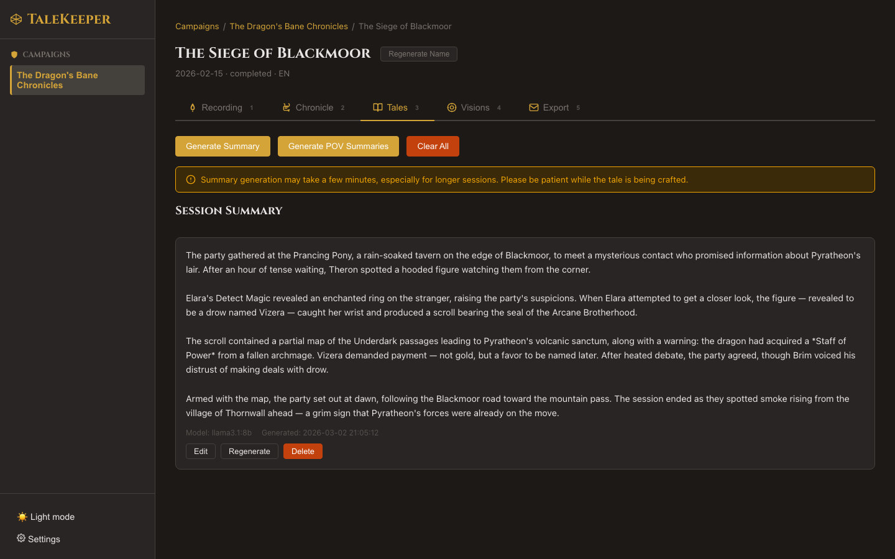

# Session Summaries

## The Chronicler's Quill

The **Tales** tab (++3++) is where AI transforms your raw transcript into a polished narrative recap of your session.

### Generating a Summary

1. Switch to the **Tales** tab
2. Click **Generate Summary**
3. Wait for the AI to process your transcript

The summary appears as a narrative recap — written in prose, covering the key events, decisions, and dramatic moments of your session.

!!! info "How It Works"
    TaleKeeper sends your transcript to your connected AI assistant, along with character descriptions from your roster. The AI generates a narrative summary in the session's language.

### Editing Summaries

Click on a summary to edit its content directly. Changes are saved when you finish editing.

### Regenerating

Not happy with the result? Click **Regenerate** to create a new summary. This replaces the existing one.

!!! tip "Hidden Feature: Auto Session Naming"
    When a summary is generated, TaleKeeper also creates a **catchy session title** based on the content. Sessions with generic "Session N" names get upgraded to something like "The Siege of Blackmoor" or "Betrayal at the Crossroads". Custom names you've set are never overwritten.

!!! tip "Character Descriptions Enhance Summaries"
    If you've filled in character descriptions in your [roster](../campaigns/roster.md), the AI uses them when writing summaries — leading to more accurate character portrayals and richer narrative detail.

### Multiple Summaries

You can generate multiple summaries per session. Each is stored independently and can be exported separately.

Next: [Character Journal Entries →](pov-journals.md)
