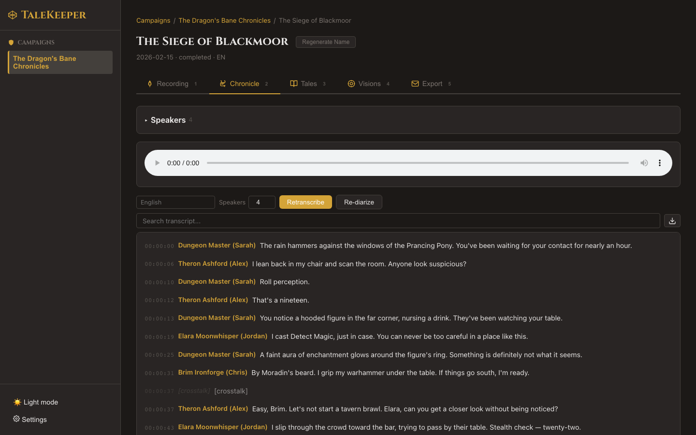

# Transcription

## The Scribe's Art

TaleKeeper uses on-device speech recognition optimized for Apple Silicon to transcribe your recordings. Everything runs locally — your audio never leaves your machine.

### Viewing the Transcript

Switch to the **Chronicle** tab (++2++) to see your full transcript.

Each segment shows:

- **Timestamp** — when the words were spoken
- **Speaker** — who said it (assigned by diarization)
- **Text** — what was said

!!! tip "Click to Seek"
    Click any transcript segment to jump to that moment in the audio player. As audio plays, the **active segment is highlighted** with a gold border and the transcript auto-scrolls to follow along. Navigation works both ways — click a segment to seek, or let playback drive the scroll.

### Search and Filter

The **search bar** at the top of the Chronicle tab lets you filter transcript segments. It matches against both **text content** and **speaker names** — type a character name to see only their lines.

A match count shows how many segments match your query. Click **Clear** to reset.

### Copying and Downloading

- **Copy a line**: hover over any segment to reveal a **clipboard icon**. Clicking it copies the segment with its timestamp and speaker name — ready to paste into Discord, notes, or a blog.
- **Download transcript**: click the **download icon** in the search bar to export the full transcript as a `.txt` file.

### Color-Coded Speakers

Each speaker is assigned a **unique color** that's consistent throughout the transcript. This makes it easy to visually follow who's speaking, even in long sessions with many participants.

### Smart Segment Splitting

When a single transcript segment contains two different speakers (common during rapid back-and-forth exchanges), TaleKeeper automatically **splits it** so each speaker gets their own line. This happens behind the scenes during speaker identification — you just see clean, correctly attributed segments.

### Volume Normalization

Players sitting farther from the microphone can be harder to detect. TaleKeeper automatically **adjusts for volume differences** so that quiet speakers are identified just as reliably as loud ones.

### Crosstalk Indicators

When multiple speakers talk over each other, those segments appear at **reduced opacity** with an italic `[crosstalk]` label. This makes it easy to spot moments of overlapping speech without cluttering the readable transcript.

### Whisper Models

The model affects speed and accuracy. Configure it in **Settings**.

| Model | Speed | Accuracy | Best For |
|-------|-------|----------|----------|
| `tiny` | ~30 sec / 10 min audio | Lower | Quick previews, testing |
| `base` | ~1 min / 10 min audio | Fair | Short sessions |
| `small` | ~2 min / 10 min audio | Good | Most sessions |
| `medium` | ~3 min / 10 min audio | Very Good | Balanced option |
| **`distil-large-v3`** | ~2 min / 10 min audio | **Excellent** | **Recommended default** |
| `large-v3` | ~5 min / 10 min audio | Best | Critical recordings, accented speech |

!!! info "Noise Filtering"
    Before transcribing, TaleKeeper automatically filters out silences, background music, and non-speech noise. This makes transcription faster and more accurate.

!!! info "Long Sessions"
    For longer recordings, TaleKeeper automatically handles them in sections to ensure nothing is missed. You don't need to do anything — it's all handled for you.

### Language Support

TaleKeeper supports **98 languages** out of the box. Set the language at the campaign or session level, and transcription, summaries, and session names will all respect it.

Common languages: English, Spanish, French, German, Japanese, Korean, Chinese, Hebrew, Arabic, Portuguese, Italian, Russian, and [many more](../tips-and-tricks.md).

Next: [Re-run Transcription →](retranscription.md)
